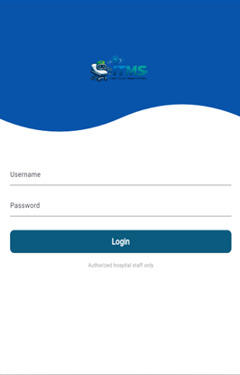
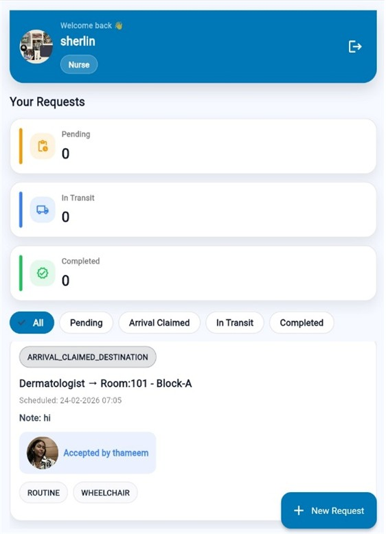
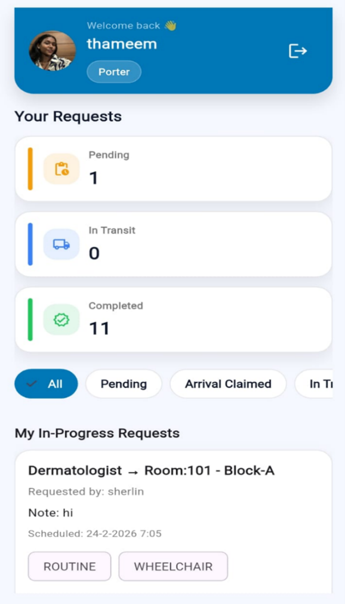
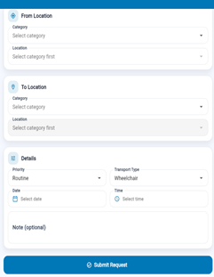
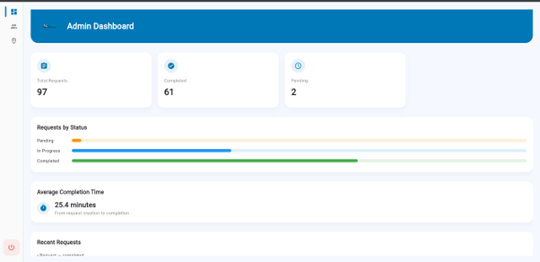
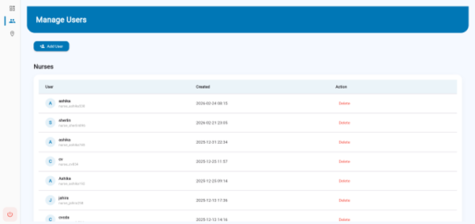
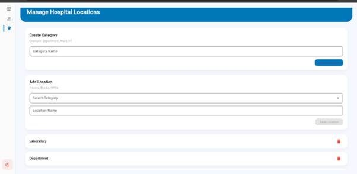
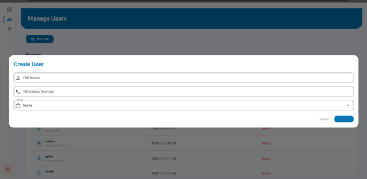
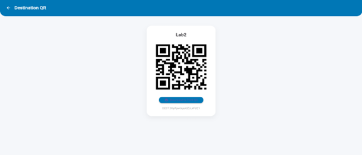

# 🏥 Inpatient Transport Management System (ITMS)

A real-time hospital workflow management application built using **Flutter** and **Firebase** to streamline patient transport requests between departments.

---

## 🎯 Problem Statement

In many hospitals, patient transport is handled manually, leading to:

- Delays in moving patients  
- Miscommunication between staff  
- No real-time visibility of request status  

👉 This system solves these issues by digitizing and automating the entire workflow.

---

## 🚀 Features

- 🔐 Role-based access (Admin, Nurse, Porter)  
- 📲 Real-time request creation and tracking  
- 🔄 Live status updates using Firestore  
- 📋 Centralized request management  
- ⚡ Efficient hospital workflow handling  

---

## 🧑‍⚕️ System Workflow

1. Nurse creates a patient transport request  
2. Admin assigns a porter  
3. Porter updates the request status  
4. All updates are reflected in real-time  

---

## 🏗️ Architecture

- **Frontend:** Flutter  
- **Authentication:** Firebase Auth  
- **Database:** Cloud Firestore (real-time updates)  

---

## 🛠️ Tech Stack

- Flutter (Dart)  
- Firebase Authentication  
- Cloud Firestore  
- Git & GitHub  

---

## 📱 Screenshots

### 🔐 Login


### 👩‍⚕️ Nurse Dashboard


### 👨‍🔧 Porter Dashboard


### 📝 Create Request


### 🧑‍💼 Admin Dashboard


### 👥 Manage Users


### 🏥 Manage Locations


### ➕ Create User Dialog


### 📄 QR Printing


---

## 💻 Installation

```bash
git clone https://github.com/ashika-begum/itms-hospital-management-flutter.git
cd itms-hospital-management-flutter
flutter pub get
flutter run
```

## 🔐 Firebase Setup

To run this project, add your Firebase configuration files:

- android/app/google-services.json  
- ios/Runner/GoogleService-Info.plist  

---

## 📌 Key Highlights

- Built a real-world hospital workflow system  
- Implemented role-based access control  
- Integrated real-time database using Firestore  
- Designed scalable request lifecycle management  

---

## 👩‍💻 Author

Ashika Begum  
🔗 LinkedIn: https://linkedin.com/in/ashika-begum-649877366  

---

## ⭐ Support

If you found this project useful, please ⭐ the repository!
